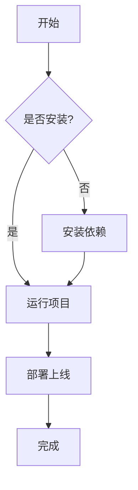

import Tabs from '@/components/markdown/Tabs.astro'
import TabItem from '@/components/markdown/TabItem.astro'

# 有序列表
::::tabs
:::tab{label="效果预览"}
1. item 1
2. item 2
3. item 3
:::
:::tab{label="代码"}
```markdown
1. item 1
2. item 2
3. item 3
```
:::
::::

# 无序列表
::::tabs
:::tab{label="效果预览"}
- item 1
- item 2
- item 3
:::
:::tab{label="代码"}
```markdown
- item 1
- item 2
- item 3
```
:::
::::

# 删除线
::::tabs
:::tab{label="效果预览"}
~~这是一个删除线示例。~~
:::
:::tab{label="代码"}
```markdown
~~这是一个删除线示例。~~
```
:::
::::

# 代码块
::::tabs
    :::tab{label="效果预览"}
    ```cpp
    #include <stdio.h>

    int main() {
        printf("Hello, World!\n");
        return 0;
    }
    ```
    :::
    :::tab{label="代码"}
    ````markdown
    ```cpp
    #include <stdio.h>

    int main() {
        printf("Hello, World!\n");
        return 0;
    }
    ```

    ````
    :::
::::

## 代码标题
通过title属性，可以给代码块添加标题
::::tabs
    :::tab{label="效果预览"}
    ```cpp title="main.cpp" frame
    #include <stdio.h>

    int main() {
        printf("Hello, World!\n");
        return 0;
    }
    ```
    :::
    :::tab{label="代码"}
    ````markdown
    ```cpp title="main.cpp"
    #include <stdio.h>

    int main() {
        printf("Hello, World!\n");
        return 0;
    }
    ```

    ````
    :::
::::


## 展开/收起
可以在代码块的语法中添加`collapse`属性来添加的展开/收起

::::tabs
  :::tab{label="效果预览"}
  ```cpp title="main.cpp" collapse
  int main () {
      printf("Hello, World!\n");
      printf("Hello, World!\n");
      printf("Hello, World!\n");
      printf("Hello, World!\n");
      printf("Hello, World!\n");
      printf("Hello, World!\n");
      printf("Hello, World!\n");
      printf("Hello, World!\n");
      printf("Hello, World!\n");
      printf("Hello, World!\n");
      printf("Hello, World!\n");
      printf("Hello, World!\n");
      printf("Hello, World!\n");
      printf("Hello, World!\n");
      printf("Hello, World!\n");
      printf("Hello, World!\n");
      printf("Hello, World!\n");
      printf("Hello, World!\n");
      printf("Hello, World!\n");
      printf("Hello, World!\n");
      printf("Hello, World!\n");
      printf("Hello, World!\n");
      printf("Hello, World!\n");
      return 0;
  }
  ```
  :::

  :::tab{label="代码"}
  ````markdown
  ```cpp title="main.cpp" collapse
  int main () {
      printf("Hello, World!\n");
      printf("Hello, World!\n");
      printf("Hello, World!\n");
      printf("Hello, World!\n");
      printf("Hello, World!\n");
      printf("Hello, World!\n");
      printf("Hello, World!\n");
      printf("Hello, World!\n");
      printf("Hello, World!\n");
      printf("Hello, World!\n");
      printf("Hello, World!\n");
      printf("Hello, World!\n");
      printf("Hello, World!\n");
      printf("Hello, World!\n");
      printf("Hello, World!\n");
      printf("Hello, World!\n");
      printf("Hello, World!\n");
      printf("Hello, World!\n");
      printf("Hello, World!\n");
      printf("Hello, World!\n");
      printf("Hello, World!\n");
      printf("Hello, World!\n");
      printf("Hello, World!\n");
      return 0;
  }
  ```
  ````
  :::
::::


# 引用
> 这是一个引用示例。


# 扩展语法

## Katex 数学公式

块级公式
::::tabs
:::tab{label="效果预览"}
$$
E = mc^2
$$
:::

:::tab{label="代码"}
```latex
$$
E = mc^2
$$
```
:::
::::

行内公式
::::tabs
:::tab{label="效果预览"}
爱因斯坦的质能方程是 $E = mc^2$，其中 $E$ 是能量，$m$ 是质量，$c$ 是光速。
:::
:::tab{label="代码"}
```latex
爱因斯坦的质能方程是 $E = mc^2$，其中 $E$ 是能量，$m$ 是质量，$c$ 是光速。
```
:::
::::

## 提示框
<Tabs>
  <TabItem label="效果预览">
:::note
这是一个 note 类型的提示框。
:::

:::tip
这是一个 tip 类型的提示框。
:::

:::important
这是一个 important 类型的提示框。
:::

:::warning
这是一个 warning 类型的提示框。
:::

:::caution
这是一个 caution 类型的提示框。
:::
    </TabItem>
    <TabItem label="代码">
    ```markdown
    :::note
    这是一个 note 类型的提示框。
    :::

    :::tip
    这是一个 tip 类型的提示框。
    :::

    :::important
    这是一个 important 类型的提示框。
    :::

    :::warning
    这是一个 warning 类型的提示框。
    :::

    :::caution
    这是一个 caution 类型的提示框。
    :::
    ```
    </TabItem>
</Tabs>

## Steps

:::::tabs

::::tab{label="效果预览"}

:::steps

1. 创建一个新项目

   使用你喜欢的包管理器创建项目。

   ```cpp title="main.cpp"
   #include <stdio.h>

   int main() {
       printf("Hello, World!\n");
       return 0;
   }
   ```

2. 安装依赖

   运行 `npm install` 安装所有依赖。

3. 启动开发服务器

   使用 `npm run dev` 启动开发服务器。

:::

::::

::::tab{label="代码"}
````markdown
:::steps

1. 创建一个新项目

   使用你喜欢的包管理器创建项目。

   ```cpp title="main.cpp"
   #include <stdio.h>

   int main() {
       printf("Hello, World!\n");
       return 0;
   }
   ```

2. 安装依赖

   运行 `npm install` 安装所有依赖。

3. 启动开发服务器

   使用 `npm run dev` 启动开发服务器。

:::
````
::::

:::::


## Tabs

效果预览

::::tabs

:::tab{label="npm"}
```bash
npm install astro
```
:::

:::tab{label="pnpm"}
```bash
pnpm add astro
```
:::

:::tab{label="yarn"}
```bash
yarn add astro
```
:::

::::

代码语法
````markdown
::::tabs
:::tab{label="npm"}
```bash
npm install astro
```
:::

:::tab{label="pnpm"}
```bash
pnpm add astro
```
:::

:::tab{label="yarn"}
```bash
yarn add astro
```
:::
::::
````

## FileTree

:::::tabs
::::tab{label="效果预览"}
:::filetree
- astro.config.mjs
- package.json
- **README.md**
- src
  - components
    - **Header.astro**
    - Footer.astro
  - layouts
    - Layout.astro
  - pages
    - index.astro
    - about.astro
    - posts
      - [...slug].astro
  - styles
    - global.css
- public
  - favicon.svg
  - …
- tsconfig.json
:::
::::
::::tab{label="代码"}
````markdown
:::filetree
- astro.config.mjs
- package.json
- **README.md**
- src
  - components
    - **Header.astro**
    - Footer.astro
  - layouts
    - Layout.astro
  - pages
    - index.astro
    - about.astro
    - posts
      - [...slug].astro
  - styles
    - global.css
- public
  - favicon.svg
  - …
- tsconfig.json
:::
````
::::
:::::

## Mermaid
博客集成了 mermaid，可以方便地创建各种流程图。
<Tabs>
  <TabItem label="效果预览">

  </TabItem>
  <TabItem label="代码">
````markdown

````
  </TabItem>
</Tabs>

## Infographic
博客集成了 antv/infographic，可以方便地创建信息图表。
<Tabs>
  <TabItem label="效果预览">
```infographic
infographic list-row-simple-horizontal-arrow
data
  title 项目开发流程
  desc 从需求到上线的完整流程
  lists
    - label 需求分析
      desc 收集与整理需求
    - label 方案设计
      desc 架构与技术选型
    - label 编码开发
      desc 功能实现与调试
    - label 测试验收
      desc 质量保障与验证
    - label 部署上线
      desc 发布与监控
```
  </TabItem>
  <TabItem label="代码">
````markdown
```infographic
infographic list-row-simple-horizontal-arrow
data
  title 项目开发流程
  desc 从需求到上线的完整流程
  lists
    - label 需求分析
      desc 收集与整理需求
    - label 方案设计
      desc 架构与技术选型
    - label 编码开发
      desc 功能实现与调试
    - label 测试验收
      desc 质量保障与验证
    - label 部署上线
      desc 发布与监控
```
````
  </TabItem>
</Tabs>

