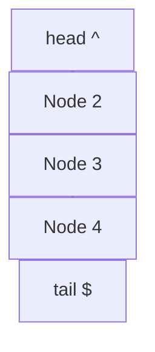
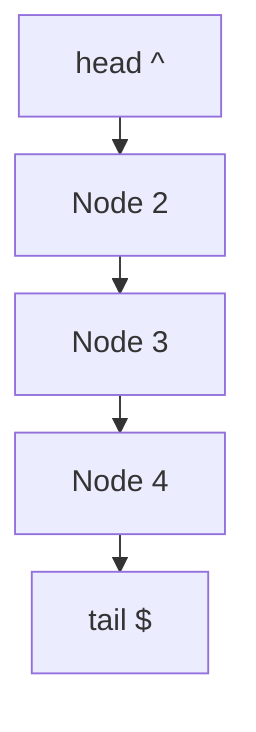
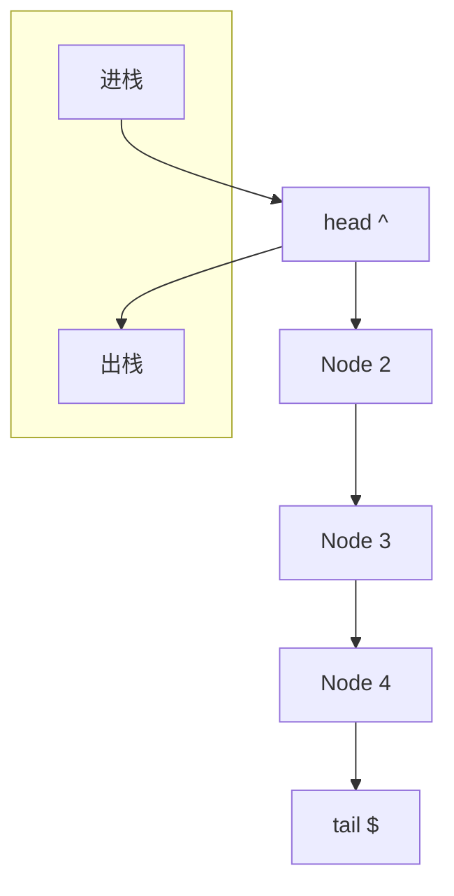
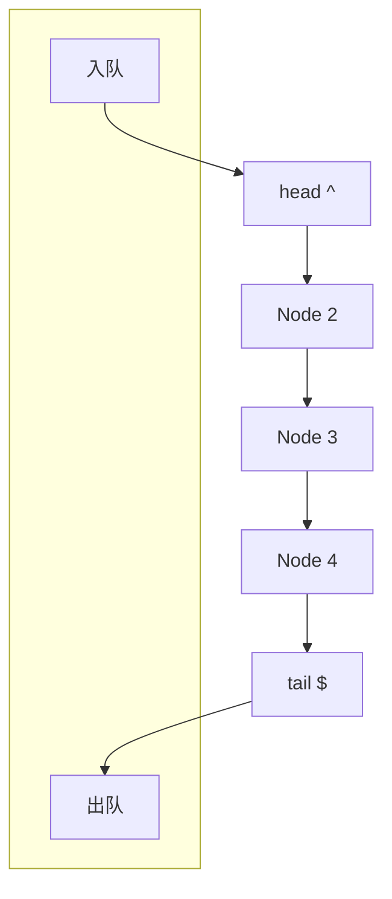
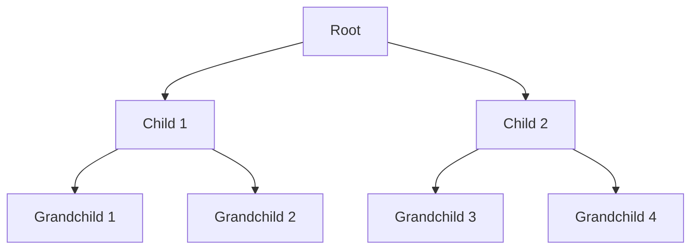
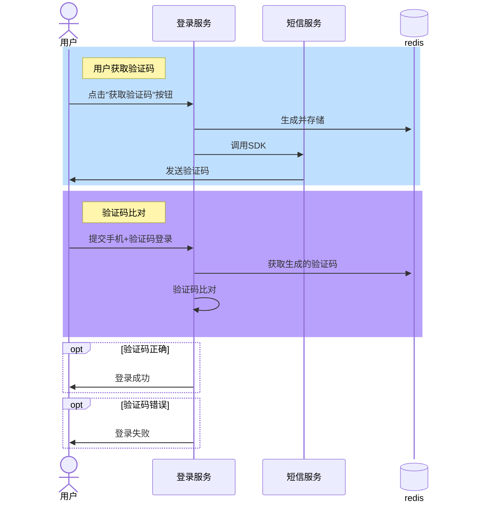

# 数据结构
之前写算法的时候，经常需要画一些数据结构图，最近发现使用mermaid来画图，效果非常好，而且不需要引入各种图片

## 数组
:::note
使用rankSpacing可以调整层级的间距，让节点紧邻
:::

```mermaid
%%{init: {'flowchart': {'nodeSpacing': 0, 'rankSpacing': 1}}}%%
graph TD
    A["head ^"] --> B[Node 2]
    B --> C[Node 3]
    C --> D[Node 4]
    D --> E["tail $"]
```

## 链表

```mermaid
%%{init: {'flowchart': {'nodeSpacing': 0, 'rankSpacing': 20}}}%%

graph TD
    A["head ^"] --> B[Node 2]
    B --> C[Node 3]
    C --> D[Node 4]
    D --> E["tail $"]
```

## 栈

```mermaid
%%{init: {'flowchart': {'rankSpacing': 50}}}%%

graph TD
    subgraph " "
        进栈
        出栈
    end
    进栈 --> A
    A --> 出栈
    A["head ^"] --> B[Node 2]
    B --> C[Node 3]
    C --> D[Node 4]
    D --> E["tail $"]
```

## 队列

```mermaid
%%{init: {'flowchart': {'rankSpacing': 50}}}%%

graph TD
    subgraph " "
        入队
        出队
    end
    入队 --> A
    E --> 出队
    A["head ^"] --> B[Node 2]
    B --> C[Node 3]
    C --> D[Node 4]
    D --> E["tail $"]
```

## 树

```mermaid
graph TB
    A[Root] --> B[Child 1]
    A --> C[Child 2]
    B --> D[Grandchild 1]
    B --> E[Grandchild 2]
    C --> F[Grandchild 3]
    C --> G[Grandchild 4]
```
# 时序图
以一个用户验证码登录流程为例，展示时序图的使用

```mermaid
sequenceDiagram
    actor user as 用户
    participant server as 登录服务
    participant sms as 短信服务
    participant redis@{ "type": "database" }

    rect rgb(191, 223, 255)
        note right of user:用户获取验证码
        user ->> server: 点击"获取验证码"按钮
        server ->>+ redis: 生成并存储
        server ->> sms: 调用SDK
        sms ->> user: 发送验证码
    end

    rect rgb(184, 161, 252)
        note right of user: 验证码比对
        user ->> server: 提交手机+验证码登录
        server ->> redis: 获取生成的验证码
        server ->> server: 验证码比对
    end

    opt 验证码正确
        server ->> user: 登录成功
    end
    opt 验证码错误
        server ->> user: 登录失败
    end
```

# 状态机